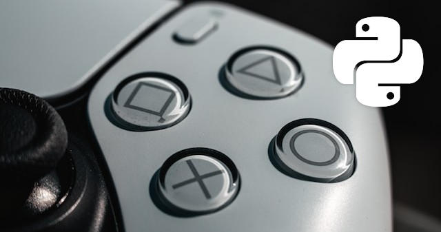

# DualSense™ controller for Python

Use the Sony DualSense™ controller (PlayStation 5 controller) with Python.



## Features

- Python support for Windows and Linux. See [Tested with](#tested-with) section.
- Connection via USB or Bluetooth
- Simple, flexible and intuitive event-based API
- Read and listen to all analog and digital inputs
- Read and listen to battery state
- Read and listen to touchpad
- Set lights (Microphone light and Player LEDs) and its brightness,
- Set the lightbar's color,
- Set haptic feedback
- Set adaptive triggers (experimental - work in progress)

## Contents

- [Requirements](#requirements)
- [Installation](#installation)
    - [Prerequisites for Windows](#prerequisites-for-windows)
    - [Prerequisites for Linux](#prerequisites-for-linux)
        - [HIDAPI on Linux](#hidapi-on-linux)
        - [udev-rules](#udev-rules)
    - [Install the library](#install-the-library)
- [Usage](#usage)
    - [Getting started - Simple example](#getting-started---simple-example)
    - [List available devices](#list-available-devices)
    - [Initialization](#initialization)
    - [Lifecycle](#lifecycle)
    - [Errors during operation](#errors-during-operation)
    - [Read and listen to Battery](#read-and-listen-to-battery)
    - [Digital buttons](#digital-buttons)
    - [Analog buttons](#analog-buttons)
    - [Touchpad](#touchpad)
    - [Gyroscope, Accelerotmeter and Orientation](#gyroscope-accelerometer-and-orientation)
    - [Lightbar color](#lightbar-color)
    - [Player LEDs](#player-leds)
    - [Haptic feedback (Rumble)](#haptic-feedback-rumble)
    - [Adaptive Triggers](#adaptive-triggers)
    - [Behavioral Options](#behavioral-options)
        - [Value Mapping](#value-mapping)
- [Examples](#examples)
- [Development Notes](#development-notes)
    - [USB Sniffing on Windows with Wireshark/TShark and USBPcap](#usb-sniffing-on-windows-with-wiresharktshark-and-usbpcap)
    - [Protocol](#protocol)
- [Tested with](#tested-with)
- [MacOS support](#macos-support)
- [Special thanks to](#special-thanks-to)
- [Contribution](#contribution)
- [Trademarks Notes](#trademarks-notes)
- [Photo Credits](#photo-credits)
- [License](#license)

## Requirements

- Python 3.10+
- Kernel 5.12+ (Linux only)
- hidapi lib

## Installation

Some preparations have to be done before depending on your operating system:

### Prerequisites for Windows

Just download the [latest release of HIDAPI](https://github.com/libusb/hidapi/releases).
Unzip the release zip file und then place the according `hidapi.dll` in your workspace (i.e. `C:\Windows\System32`)
folder.
(from `x64` folder for 64-bit Windows or from `x86` folder for 32-bit Windows)

### Prerequisites for Linux

#### HIDAPI on Linux

You need [HIDAPI library](https://github.com/libusb/hidapi) installed on your system.

For example on Ubuntu install it via:

```bash
sudo apt install libhidapi-dev
```

#### udev rules

For use the controller in Python without root privileges add the udev rule.

```bash
sudo cp res/70-dualsense.rules /etc/udev/rules.d
```

or create a file `/etd/udev/rules.d/70-dualsense.rules` with following content.

```
# USB
KERNEL=="hidraw*", SUBSYSTEM=="hidraw", ATTRS{idVendor}=="054c", ATTRS{idProduct}=="0ce6", MODE="0666"
# Bluetooth
KERNEL=="hidraw*", SUBSYSTEM=="hidraw", KERNELS=="0005:054C:0CE6.*", MODE="0666"
```

Then u have to activate the rule.

```bash
sudo udevadm control --reload-rules
sudo udevadm trigger
```

### Install the library

You can now go ahead and use the library within your projects.
Add either via [pip](https://pypi.org/project/pip/):

```shell
pip install --upgrade dualsense-controller
```

or when you prefer [Python Poetry](https://python-poetry.org/) as packaging and dependency management solution:
then add via

```shell
poetry add dualsense-controller
```

## Usage

### Getting started - Simple example

Following example enables rumble on cross button press and disables rumble on release.
Example program stops on PS button pressed.

```python
from time import sleep

from dualsense_controller import DualSenseController

# list availabe devices and throw exception when tzhere is no device detected
device_infos = DualSenseController.enumerate_devices()
if len(device_infos) < 1:
    raise Exception('No DualSense Controller available.')

# flag, which keeps program alive
is_running = True

# create an instance, use fiŕst available device
controller = DualSenseController()


# switches the keep alive flag, which stops the below loop
def stop():
    global is_running
    is_running = False


# callback, when cross button is pressed, which enables rumble
def on_cross_btn_pressed():
    print('cross button pressed')
    controller.left_rumble.set(255)
    controller.right_rumble.set(255)


# callback, when cross button is released, which disables rumble
def on_cross_btn_released():
    print('cross button released')
    controller.left_rumble.set(0)
    controller.right_rumble.set(0)


# callback, when PlayStation button is pressed
# stop program
def on_ps_btn_pressed():
    print('PS button released -> stop')
    stop()


# callback, when unintended error occurs,
# i.e. physically disconnecting the controller during operation
# stop program
def on_error(error):
    print(f'Opps! an error occured: {error}')
    stop()


# register the button callbacks
controller.btn_cross.on_down(on_cross_btn_pressed)
controller.btn_cross.on_up(on_cross_btn_released)
controller.btn_ps.on_down(on_ps_btn_pressed)

# register the error callback
controller.on_error(on_error)

# enable/connect the device
controller.activate()

# start keep alive loop, controller inputs and callbacks are handled in a second thread
while is_running:
    sleep(0.001)

# disable/disconnect controller device
controller.deactivate()
```

### List available devices

Check whether devices are connected and detected

```python
device_infos = DualSenseController.enumerate_devices()
if len(device_infos) < 1:
    raise Exception('No DualSense Controller available.')
```

### Initialization

You can initialize Controllers on multiple ways:

**Variant 1**

Initialize by passing an index, (`amount of devices - 1`).

```python
controller = DualSenseController(device_index_or_device_info=0)
```

**Variant 2**

Pass a `DeviceInfo` object, obtained from the devices list.

```python
controller = DualSenseController(device_index_or_device_info=device_infos[0])
```

**Variant 3**

Just pass nothing. It will try to use the first device.

```python
controller = DualSenseController()
```

### Lifecycle

**Activation -> Operation -> Deactivation**

The controller has to be activated at first.  
Since the controller communication now takes place in a separate thread,
you must ensure that your program remains alive,
e.g. by using a while loop (possibly with a termination condition).
At the end you have to deactivate the controller.

```python
is_running = True

controller.activate()

while is_running:
    sleep(0.001)

controller.deactivate()
```

Alternatively, you can also use the controller with a [context manager](https://docs.python.org/3.11/library/contextlib.html),
which activates and deactivates controllers automatically.

```python
is_running = True

with active_dualsense_controller() as controller:
    while is_running:
        sleep(0.001)
```

### Errors during operation

In order to be able to react to unforeseen errors during operation,
such as a physical disconnect, you can handle such events in a callback.

```python
def on_error(error):
    print(f'an unforseen error occured {error}')
    # handle error
    # ...
```

Register the callback via

```python
controller.on_error(on_error)
```

### Read and listen to battery

You can read out the charge level and charge status of the battery as follows

```python
batt = controller.battery.value
print(batt)
```

or listen to changes (especially while conneted via Bluetooth):

```python
def on_battery_change(battery) -> None:
    print(f'on battery change: {battery}')


def on_battery_lower_than(battery_level) -> None:
    print(f'on battery low: {battery_level}')


def on_battery_charging(battery_level) -> None:
    print(f'on battery charging: {battery_level}')


def on_battery_discharging(battery_level) -> None:
    print(f'on battery discharging: {battery_level}')


controller.battery.on_change(on_battery_change)
controller.battery.on_lower_than(20, on_battery_lower_than)
controller.battery.on_charging(on_battery_charging)
controller.battery.on_discharging(on_battery_discharging)
```

### Digital buttons

This lib reads and reacts on the following digital buttons of the DualSense Controller:

`Up`, `Down`, `Left`, `Right`, `Cross`, `Square`, `Circle`, `Triangle`,
`L1`, `L2`, `L3`,`R1`, `R2`, `R3`, `Touchpad click`, `PlayStation`, `Mute`, `Create` and `Options`

You can listen to each button seperately if it is **pressed**, **released** or its value **changed**.

```python
def on_cross_btn_pressed():
    print('cross button pressed')


def on_cross_btn_released():
    print('cross button_released')


def on_cross_btn_changed(pressed):
    print(f'cross button is pressed: {pressed}')


controller.btn_cross.on_down(on_cross_btn_pressed)
controller.btn_cross.on_up(on_cross_btn_released)
controller.btn_cross.on_change(on_cross_btn_changed)
```

### Analog buttons

The DualSense controller has serveral analog buttons: two analog **sticks** and two analog **triggers** (`L2` and `R2`).

**Note: trigger keys can be used analog and digital. `L2` and `R2` are digital buttons too**

```python
def on_left_trigger(value):
    print(f'left trigger changed: {value}')


def on_left_stick_x_changed(left_stick_x):
    print(f'on_left_stick_x_changed: {left_stick_x}')


def on_left_stick_y_changed(left_stick_y):
    print(f'on_left_stick_y_changed: {left_stick_y}')


def on_left_stick_changed(left_stick):
    print(f'on_left_stick_changed: {left_stick}')


controller.left_trigger.on_change(on_left_trigger)
controller.left_stick_x.on_change(on_left_stick_x_changed)
controller.left_stick_y.on_change(on_left_stick_y_changed)
controller.left_stick.on_change(on_left_stick_changed)

```

### Touchpad

The DualSense Controller has a 2-point capacitive touchpad with click mechanism.
The click of the Touchpad is handled like a digital button. See [Digtal buttons](#digital-buttons)

You can listen and react on both touch events:

```python
def on_touch_finger_1(value):
    print(f'touch finger 1 changed: {value}')


def on_touch_finger_2(value):
    print(f'touch finger 2 changed: {value}')


controller.touch_finger_1.on_change(on_touch_finger_1)
controller.touch_finger_2.on_change(on_touch_finger_2)
```

### Gyroscope, Accelerometer and Orientation

You can listen on all events of the 3 axis gyroscope, the 3 axis accelerometer and the calculated orientation.

```python
def on_gyroscope_change(gyroscope):
    print(f'on_gyroscope_change: {gyroscope}')


def on_accelerometer_change(accelerometer):
    print(f'on_accelerometer_change: {accelerometer}')


def on_orientation_change(orientation):
    print(f'on_orientation_change: {orientation}')


controller.gyroscope.on_change(on_gyroscope_change)
controller.accelerometer.on_change(on_accelerometer_change)
controller.orientation.on_change(on_orientation_change)
```

### Lightbar color

The color of the lightbar can be setted with predefined values

```python
controller.lightbar.set_color_red()
# controller.lightbar.set_color_green()
# controller.lightbar.set_color_blue()
# controller.lightbar.set_color_white()
# controller.lightbar.set_color_black()
```

or with custom RGB values.

```python
controller.lightbar.set_color(88, 10, 200)
```

### Player LEDs

Turn on all LEDs

```python
controller.player_leds.set_all()
# controller.player_leds.set_inner()
# controller.player_leds.set_outer()
# controller.player_leds.set_center_and_outer()
# controller.player_leds.set_center()
```

or specific ones

```python
controller.player_leds.set_inner()
# controller.player_leds.set_outer()
# controller.player_leds.set_center_and_outer()
# controller.player_leds.set_center()
```

or turn off all

```python
controller.player_leds.set_off()
```

and modify their brightness.

```python
controller.player_leds.set_brightness_high()
# controller.player_leds.set_brightness_medium()
# controller.player_leds.set_brightness_low()
```

### Haptic feedback (Rumble)

The haptic feedback is controlled by the left and right builtin rumble motors. You can set both of them independently.

**Attention:** the according rumble values depend on the chosen [Value Mapping](#value-mapping).
By default it is a value between 0 and 255.

```python
controller.left_rumble.set(0)  # no rumble
# controller.left_rumble.set(128)  # medium rumble
# controller.left_rumble.set(255) # strong rumble
```

### Adaptive Triggers

This feature is a work in progress and not all possibilities have been exhausted yet.
However, this library provides a few essential effects.
Contribution is explicitly desired at this point.

The following effects are implemented and can be used:

#### Off (No effect)

This is the default trigger effect and means that there is no trigger effect :P
Recommended to unset all trigger effects or apply no effect.

```python
controller.left_trigger.effect.off()
```

#### No resistance

This effect is similar to the [Off](#off-no-effect) effect. (Not recommended, Use [Off](#off-no-effect) instead)

```python
controller.left_trigger.effect.no_resistance()
```

#### Continuous resistance

This effect means there is a continuous resistance, starting at a defined position and is applied with following values:

- `start_position` between 0 and 255 inclusive
- `force` strength of the effect, between 0 and 255 inclusive

```python
controller.left_trigger.effect.continuous_resistance(start_position=0, force=255)  # full resistance
# controller.left_trigger.effect.continuous_resistance(start_position=127, force=255) # full resist. starts at middle pos
# controller.left_trigger.effect.continuous_resistance(start_position=0, force=128)  # medium resistance
```

#### Feedback

This effect is similar to [Continuous resistance](#continuous-resistance)
Trigger will resist movement beyond the start position and applied with following values:

- `start_position`: The starting zone of the trigger effect. Must be between 0 and 9 inclusive.
- `strength`: The force of the resistance. Must be between 0 and 8 inclusive.

```python
controller.left_trigger.effect.feedback(start_position=0, strength=8)  # full resistance
# controller.left_trigger.effect.feedback(start_position=0, strength=3)  # less resistance
# controller.left_trigger.effect.feedback(start_position=4, strength=3)  # less resistance, starting at middle position
```

#### Multiple position feedback

This effect is like the [Feedback](#feedback) effect it will resist movement at varrying strengths in 10 regions
and is applied with following values:

- `strengths`: List of 10 resistance values for zones 0 through 9. Each value must be between 0 and 8 inclusive.

```python
controller.left_trigger.effect.feedback((0, 0, 0, 0, 8, 8, 0, 0, 0, 0))
# controller.left_trigger.effect.feedback((8, 8, 0, 0, 0, 0, 0, 0, 8, 8)) 
```

#### Slope feedback

This effect will resist movement at a linear range of strengths

`start_position`: The starting zone of the trigger effect. Must be between 0 and 8 inclusive.
`end_position`: The ending zone of the trigger effect. Must be between `start_position` + 1 and 9 inclusive.
`start_strength`: The force of the resistance at the start. Must be between 1 and 8 inclusive.
`end_strength`: The force of the resistance at the end. Must be between 1 and 8 inclusive.

```python
controller.left_trigger.effect.slope_feedback(start_position=0, end_position=9, start_strength=1, end_strength=4) 
```

#### Section resistance

This effect means only a custom section has resistance and is applied with following values:

- `start_position` between 0 and 255 inclusive
- `end_position` between greather than `start_position` and 255 inclusive
- `force` strength of the effect, between 0 and 255 inclusive

```python
controller.left_trigger.effect.section_resistance(start_position=70, end_position=100, force=255)  # full
# controller.left_trigger.effect.set_section_resistance(start_pos=70,end_pos=100,force=10) # low resistance
```

#### Weapon

This effect is similar to [Section resistance](#section-resistance) means resist movement beyond
the start position until the end position.

- `start_position`: The starting zone of the trigger effect. Must be between 2 and 7 inclusive.
- `end_position`: The ending zone of the trigger effect. Must be between `start_position` + 1 and 8 inclusive.
- `strength`: The force of the resistance. Must be between 0 and 8 inclusive.

```python
controller.left_trigger.effect.weapon(start_position=2, end_position=5, strength=8) 
```

#### Bow

This effect is similar to [Weapon](#weapon) effect. There is a snap-back force that attempts to reset the trigger.

`start_position`: The starting zone of the trigger effect. Must be between 0 and 8 inclusive.
`end_position`: The ending zone of the trigger effect. Must be between `start_position` + 1 and 8 inclusive.
`strength`: The force of the resistance. Must be between 0 and 8 inclusive.
`snap_force`: The force of the snap-back. Must be between 0 and 8 inclusive.

```python
controller.left_trigger.effect.bow(start_position=1, end_position=4, strength=1, snap_force=8) 
```    

#### Galloping

Trigger will oscillate in a rythmic pattern resembling galloping.
Note that the effect is only discernable at low frequency values.

- `start_position`: The starting zone of the trigger effect. Must be between 0 and 8 inclusive.
- `end_position`: The ending zone of the trigger effect. Must be between `start_position` + 1 and 9 inclusive.
- `first_foot`: Position of second foot in cycle. Must be between 0 and 6 inclusive.
- `second_foot`: Position of second foot in cycle. Must be between `first_foot` + 1 and 7 inclusive.
- `frequency`: Frequency of the automatic cycling action in hertz.

```python
controller.left_trigger.effect.bow(start_position=0, end_position=9, first_foot=4, second_foot=7, frequency=2) 
```    

#### Machine

This effect resembles Vibration but will oscilate between two amplitudes.

`start_position`: The starting zone of the trigger effect. Must be between 0 and 8 inclusive
`end_position`: The ending zone of the trigger effect. Must be between `start_position` + 1 and 9 inclusive
`amplitude_a`: Primary strength of cycling action. Must be between 0 and 7 inclusive
`amplitude_b`: Secondary strength of cycling action. Must be between 0 and 7 inclusive
`frequency`: Frequency of the automatic cycling action in hertz
`period`: Period of the oscillation between `amplitude_a` and `amplitude_b` in tenths of a second

```python
controller.left_trigger.effect.machine(
    start_position=1,
    end_position=9,
    amplitude_a=2,
    amplitude_b=7,
    frequency=5,
    period=3
) 
```    

#### Simple vibration

This effect starts to vibrate at a given position.

- `start_position`: The starting zone of the trigger effect.
- `amplitude`: Strength of the automatic cycling action.
- `frequency`: Frequency of the automatic cycling action in hertz.

```python
controller.left_trigger.simple_vibration(start_position=0, amplitude=255, frequency=8)
```   

#### More effect presets

There are more non-parametrized effects. Try them out:

```python
controller.left_trigger.full_press()
controller.left_trigger.soft_press()
controller.left_trigger.medium_press()
controller.left_trigger.hard_press()
controller.left_trigger.pulse()
controller.left_trigger.choppy()
controller.left_trigger.soft_rigidity()
controller.left_trigger.medium_rigidity()
controller.left_trigger.max_rigidity()
controller.left_trigger.half_press()
``` 

### Behavioral Options

The behaviour of some aspects can be adjusted via the following optional parameters during initialization.

#### Value Mapping

You can change the value mapping for analog values, like stick axis, trigger values and rumble intensity
By default the stick axis values are mapped from -128 to 127 (default mapping)
and the trigger values from 0 to 255, which means the stick axis default position values are 0
and trigers default position values are 0.

Optional stick deadzones should be adjusted properly depending on the mapping, i.e. value 3 is fine
when the stick axis values range from -128 to 127. But it is too high,
when stick range is interpreted as -1.0 to 1.0 (normalized mapping),
then you should use a deadzone which is smaller than 1.

To apply a custom mapping, i.e. normalized mapping (-1.0 to 1.0) pass it on initialization:

```python
controller = DualSenseController(
    # ...
    mapping=Mapping.NORMALIZED,
    # ...
)
```

Available mappings are:

- `Mapping.RAW`: stick x axis values from 0 to 255, stick y axis values from 0 to 255, trigger values from 0 to 255,
  rumble from 0 to 255
- `Mapping.RAW_INVERTED`: same as `Mapping.RAW` but stick y axis values inverted.
- `Mapping.DEFAULT`: stick x axis values from -128 to 127, stick y axis values from 127 to -128, trigger values from 0
  to 255, rumble from 0 to 255
- `Mapping.DEFAULT_INVERTED`: same as `Mapping.DEFAULT` but stick y axis values inverted.
- `Mapping.NORMALIZED`: stick x axis values from -1.0 to 1.0, stick y axis values from 1.0 to -1.0, trigger values from
  0.0 to 1.0, rumble from 0 to 1.0
- `Mapping.NORMALIZED_INVERTED`: same as `Mapping.NORMALIZED` but stick y axis values inverted.
- `Mapping.HUNDRED`:

## Examples

Not all funcionality is explicitly explained here, so take a look at the example files here,
to see more use cases take a look into the `./src/examples`:

## Development Notes

We tried different ways to get all the secrets out of the controller. We have documented some of the procedures here.

### USB Sniffing on Windows with Wireshark/TShark and USBPcap

Wireshark with USBPcap install is required. Ensure that your Wireshark and USBPcapCMD binaries are in the
Windows Path variable.

1. find controller in USB tree to detect Root Device, i.e. `\\.\USBPcap3`
    ```cmd
    USBPcapCMD.exe
    ```
2. Run Capture in Wireshark for that device, start an app which permanently sends Data to controller
   like [nondebug Dualsense Explorer](https://nondebug.github.io/dualsense/dualsense-explorer.html) (Chrome browser
   required)
3. In Wireshark find Destination Number for appropriate device (out) i.e. `3.8.3`
4. Run script:
    ```cmd
    python tools_dev/shark/shark.py USBPcap3 3.8.3
    ```

The output should look like:

```
02 ff f7 00 00 00 00 00 00 00 10 26 90 a0 ff 00 00 00 00 00 00 00 26 90 a0 ff 00 00 00 00 00 00 00 00 00 00 00 00 00 00 02 00 02 00 00 ff ff ff
operating_mode: 02
flags_physics: ff
flags_controls: f7
motor_right: 00
motor_left: 00
microphone_led: 00
microphone_mute: 10
right_trigger: 26 90 a0 ff 00 00 00 00
left_trigger: 26 90 a0 ff 00 00 00 00
led_options: 00
lightbar_pulse_options: 02
player_leds_brightness: 00
player_leds_enable: 00
color: ff ff ff

```

### Protocol

For communication between PC and controller there is a byte-based protocol, which has been deciphered to a large extent.
The meaning of individual bytes and byte sequences in both direction - from and to the controller - is documented in the
files [docs/dualsense-controller.ods](https://github.com/yesbotics/dualsense-controller-python/blob/main/docs/dualsense-controller.ods)
and [README_PROTOCOL.md](https://github.com/yesbotics/dualsense-controller-python/blob/main/README_PROTOCOL.md)

## Tested with

Windows:

- Windows 10 Professional

Linux:

- Manjaro Linux (6.1.38-1-MANJARO (64-bit)), Python 3.11.x
- Ubuntu 22.04 Linux 64-bit, Python 3.10.x

## MacOS support

MacOS is not supported currently.
We are discussing the viability of implementation and there may also be macos support in the future.

## Special thanks to

This project's was heavily inspired by the following projects.
A lot of implementation details were borrowed and know-how were extracted from them.

- [pydualsense](https://github.com/flok/pydualsense): Another good python lib for DualSense controller
- [DualSense explorer tool](https://github.com/nondebug/dualsense): Another good python lib for DualSense controller
- [ds5ctl](https://github.com/theY4Kman/ds5ctl): A GUI tool for configuring a DualSense 5 controller
- [PS5 Library of USB_Host_Shield_2.0](https://github.com/felis/USB_Host_Shield_2.0#ps5-library): A DualSense Controller
  library for arduino
- [DualSense on Windows \[API\]](https://github.com/Ohjurot/DualSense-Windows): Windows API for the DualSense DualSense
  controller written in C++ for C++.
- [TriggerEffectGenerator.cs ](https://gist.github.com/Nielk1/6d54cc2c00d2201ccb8c2720ad7538db?permalink_comment_id=4250586):
  Factories for all DualSense trigger effects
- [ExtendInput ](https://github.com/Nielk1/ExtendInput): C# implementation of DualSense
- [Game Controller Collective Wiki: Sony DualSense](https://controllers.fandom.com/wiki/Sony_DualSense#Input_Reports):
  Helpful informations about DualSense controller internals

Libs

- [hidapi](https://github.com/libusb/hidapi): HIDAPI library for Windows, Linux, FreeBSD and macOS
- [hidapi-usb](https://github.com/flok/hidapi-cffi): Python bindings for hidapi via CFFI
- [pyhidapi](https://github.com/apmorton/pyhidapi): Python bindings for hidapi via CFFI
- [cython-hidapi](https://github.com/trezor/cython-hidapi): A Cython interface to HIDAPI library
- [hidapitester](https://github.com/todbot/hidapitester): Simple command-line program to exercise HIDAPI

## Contribution

We welcome any input from others to help us improve this software.
Feel free to send us suggestions for improvements.
In particular, collaboration on the documentation,
the haptic feedback (Rumble) and the adaptive triggers APIs are especially welcome.

## Trademarks Notes

"PlayStation", "PlayStation Family Mark", "PS5 logo", "PS5", "DualSense" and "DUALSHOCK"
are registered trademarks or trademarks of Sony Interactive Entertainment Inc.
"SONY" is a registered trademark of Sony Corporation.
The authors are not affiliated in any kind with Sony Interactive Entertainment Inc.

## Photo Credits

Teaser Image: Original photo
by <a href="https://unsplash.com/@martzzl?utm_content=creditCopyText&utm_medium=referral&utm_source=unsplash">Marcel
Strauß</a>
on <a href="https://unsplash.com/photos/gray-and-black-xbox-one-game-controller-WO4DxFdA3dY?utm_content=creditCopyText&utm_medium=referral&utm_source=unsplash">
Unsplash</a>

## License

[MIT](https://github.com/yesbotics/dualsense-controller-python/raw/main/LICENSE)